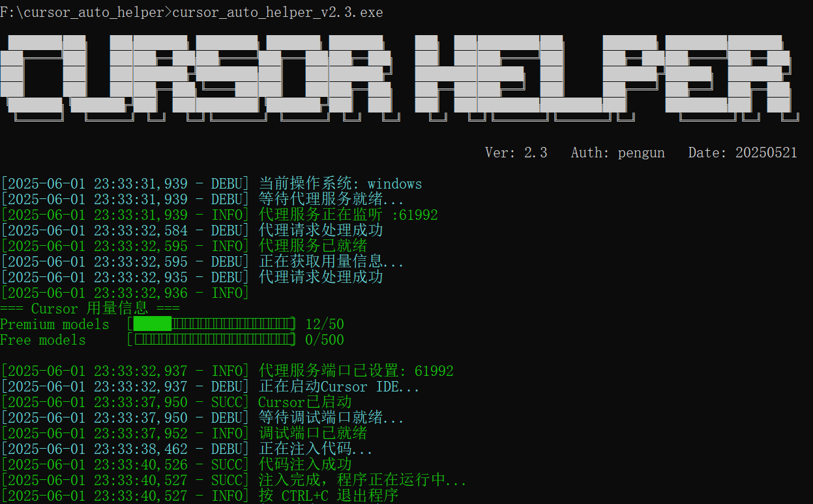
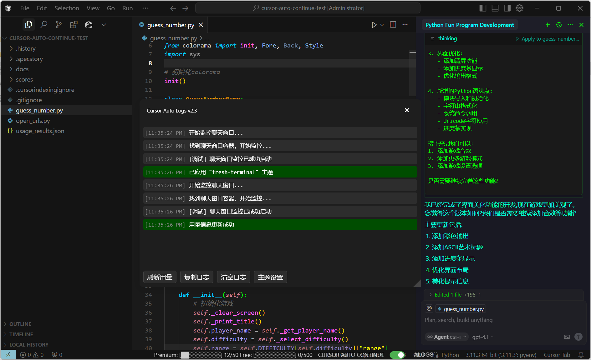

<h1 align="center">欢迎使用&nbsp;&nbsp;Cursor Auto Helper 👋</h1>
<p>
  
  
  
</p>

> Cursor自动继续工具，Cursor自动重试，Cursor自动确认，Cursor用量统计，Cursor增强工具，Cursor辅助工具，Cursor自动化工具，Cursor主题设置，Cursor Auto Continue Tool，Cursor Auto Retry Tool，Cursor Auto Confirm Tool，Cursor Usage Statistics Tool，Cursor Efficiency Tool，Cursor Automation Tool，Cursor Theme Settings，Cursor after 25 tool calls，Cursor Tool Call Limit🔧🤖🚀
> 

## 🏠 [Homepage](https://github.com/pen9un/cursor-auto-helper)

Cursor Auto Helper 是一款专为 Cursor IDE 打造的自动化增强工具，能够实时显示用量、自动处理 25 次对话限制、网络连接失败、确认提示等场景，让你的开发体验更加流畅。

🔔**注意**

先说声抱歉，Cursor 官方计费接口已修改，且启动方式也已改变，导致当前版本工具实时用量功能已失效，自动继续功能暂时也不能使用。新版本开发测试中，敬请期待！

**视频演示：** [Cursor Auto Helper 演示视频](https://www.bilibili.com/video/BV1cajKzCEzv/)

提示词质量高，项目需求规划的好，这个程序就可以让 Cursor 在无需人工干预的情况下自动完成一个项目。

> 🔒 **版本兼容**：目前在 Cursor 0.49.6 、Cursor 1.0.0 版本上开发测试通过，理论兼容 Cursor 0.48.x - 1.0.0 版本。


## 📖更新日志

- 2025-06-01 发布 v2.3 版本，增加 Cursor 主题设置功能，优化代码注入稳定性，修正用量显示和官方格式一致
- 2025-05-21 发布 v2.1 版本，重构架构，支持多平台，增加实时显示用量功能等
- 2025-04-25 完成 v1.0 版本，自动处理 25 次对话限制、网络连接失败、确认提示等场景
- 2025-04-20 项目启动

## 🌟 Cursor Auto Helper 最佳实践

注：以下文档可由 Cursor 等 AI 辅助生成，需人工核验调整。

**STEP 1：** 详细项目系统需求设计（需求梳理的越清晰，项目质量会越高），编写高质量项目开发提示词 **SYSTEM.md**

**STEP 2：** 根据 **SYSTEM.md** 输出高质量系统开发设计方案文档 **DESIGN.md**

**STEP 3：** 根据 **SYSTEM.md** 和 **DESIGN.md** 输出高质量开发计划文档 **TODOLIST.md**

**STEP 4：** 使用 **Cursor Auto Helper** ，指定 **SYSTEM.md**、**DESIGN.md**、**TODOLIST.md** ，使用自动继续反馈提示词，使 Cursor 一直自动化按照开发计划完成项目开发，直至完成

**Cursor Auto Helper 自动继续反馈提示词：**

```
@SYSTEM.md @DESIGN.md @TODOLIST.md 请严格按照TODOLIST开发计划进行后续功能开发，并实时更新记录TODOLIST开发计划，每个工作完成后需要询问我"是否继续"，直至项目完成时返回"项目已开发完毕"
```


## 🚀 使用说明

欢迎 Star 支持，如有问题请提 [Issues](https://github.com/pen9un/cursor-auto-helper/issues)。

### 📝 配置文件说明

配置文件 `config.ini` **用于自定义自动化行为**（可按需进行设置和测试），支持以下配置项：

#### 基础配置
```ini
[common]
log_enable = true     # 是否启用日志，如不想记录日志可改为false

[cursor]
path = C:\Path\To\Cursor.exe  # Cursor IDE安装路径，程序会自动查找Cursor路径，找不到时会有提示，修改此项即可
```

#### 自动动作配置
每个自动动作以 `action名称.` 为前缀，支持以下字段：

- `type`：动作类型
  - `click`：点击按钮
  - `input_and_submit`：输入并提交

- `text` / `text_list`：匹配的文本内容
  - `text`：单个字符串
  - `text_list`：| 分隔的多个字符串，页面内容包含任一项即触发

- `button_selector`：需要点击的按钮的CSS选择器（仅`click`类型需要）
- `button_text`：按钮文本内容（可选，进一步限定按钮）
- `input_box_selector`：输入框的CSS选择器（`input_and_submit`类型需要）
- `input_content`：需要自动输入的内容
- `submit_btn_selector`：提交按钮的CSS选择器
- `delay`：动作执行前的延迟（毫秒），可用于等待页面渲染

##### 配置示例
```ini
[auto_actions]
# 连接失败自动重试
action_retry.type = "click"
action_retry.text = "Connection failed. If the problem persists, please check your internet connection or VPN"
action_retry.button_selector = "div.anysphere-secondary-button"
action_retry.button_text = "Try again"
action_retry.delay = 3000

# after 25 tool calls
action_continue.type = "input_and_submit"
action_continue.text_list = "agent after 25 tool calls"
action_continue.input_box_selector = ".full-input-box.undefined"
action_continue.input_content = "请继续"
action_continue.submit_btn_selector = ".codicon-arrow-up-two"
action_continue.delay = 1000

# 自动确认继续
action_need_continue.type = "input_and_submit"
action_need_continue.text_list = "是否需要|是否继续|需要我|请告诉我"
action_need_continue.input_box_selector = ".full-input-box.undefined"
action_need_continue.input_content = "请继续后续开发，并实时记录更新开发进度"
action_need_continue.submit_btn_selector = ".codicon-arrow-up-two"
action_need_continue.delay = 1000
```

> **注意：**
> 1. 每个 action 的名称（如`action_retry`、`action_continue`）可自定义，但同一 action 的所有字段前缀需一致
> 2. CSS 选择器建议用浏览器开发者工具定位，确保准确
> 3. 配置文件修改后需要重启程序才能生效

## 🎯 应用场景

### 💼 长对话开发
- 自动处理 25 次对话限制，支持连续长对话开发，自动继续对话流程，提升开发效率。

### 👥 网络不稳定
- 自动检测网络异常，智能重试连接，自动恢复对话，保证开发连续性。

### 🏢 确认场景
- 智能识别确认提示场景，自动处理确认提示，减少人工干预。

### 📚 用量监控
- 实时统计对话次数，监控 Cursor 用量，记录使用数据，优化使用效率。

终端用量显示：



Cursor IDE 用量显示：



## 🌟功能说明

### 🤖自动继续长对话
- 自动处理 Cursor 25 次对话限制，支持多轮连续对话。

### 🎨 自动重试连接
- 自动检测网络连接失败，智能重试，实时监控连接状态。

### 📱 自动确认提示
- 智能识别多种确认提示场景，自动处理确认弹窗。
- 支持自定义确认内容和响应，减少人工干预。
- 灵活规则配置，适配多样化开发流程。

### 🛍️ 用量统计
- 实时统计对话次数和用量，自动记录数据。
- 用量数据可视化展示，便于分析和优化。
- 支持终端彩色日志显示、IDE用量面板，提升可用性。

### 💡 日志系统
- 多级别日志（DEBUG/INFO/SUCCESS/WARNING/ERROR/CRITICAL），终端彩色输出。
- 日志文件按日期自动生成，支持文件记录和拖拽显示面板。
- 实时面板便于开发者监控和回溯。

### 🔒 版本兼容与性能优化
- 基于 Cursor 0.49.6 开发，核心功能完整测试。
- 针对特定版本优化，持续跟进 Cursor 版本更新。
- 稳定性强，兼容性好，适合生产环境使用。

## 🔮效果展示

### 🤖 自动继续对话


### 🚀 Cursor自动完成程序展示

从项目需求到完整实现，全程无需人工干预：


## 🤝作者

👤 **pen9un**

* Website: https://github.com/pen9un/
* Github: [@pen9un](https://github.com/pen9un)

## ❤️支持

如果觉得此项目有用，请点一个免费的小 ⭐️⭐️

## ✨Star History

[](https://star-history.com/#pen9un/cursor-auto-helper&Date)

## 💹 访问量统计

 
